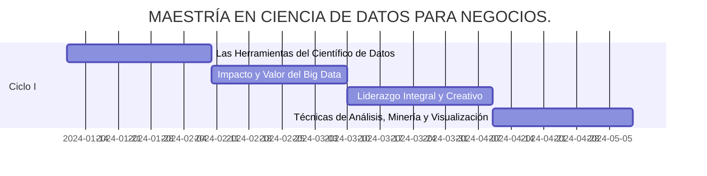
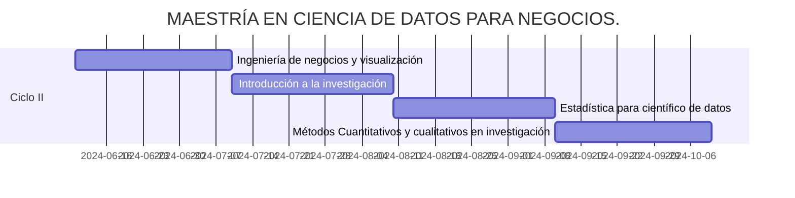
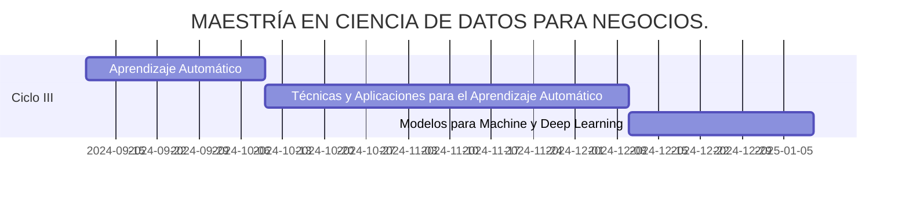

# 
Maestria Ciencia Datos Negocios

Mis trabajos de la maestría de ciencia de datos para negocios

🟠 color_naranja -> 245, 145, 55

🔵 color_azul -> 40, 100, 160

## Ciclo 1 o semestre 1

Los cursos son:

* Las herramientas del científico de datos.

* Impacto y valor del Big Data.

* Liderazgo integral y creativo.

* Técnnicas de análisis de datos, minerría y visualización.

Diagrama hecho con la libreria [Mermaid](https://github.com/mermaid-js/mermaid?tab=readme-ov-file)

## Ciclo 2 o semestre 2

Los cursos son:

* Ingeniería de negocios y visualización.
* Introducción a la investigación.
* Estadística para científico de datos.
* Métodos Cuantitativos y cualitativos en investigación.

## Ciclo 3 o semestre 3

Los cursos son:

* Aprendizaje Automático
* Técnicas y Aplicaciones para el Aprendizaje Automático
* Modelos para Machine y Deep Learning

